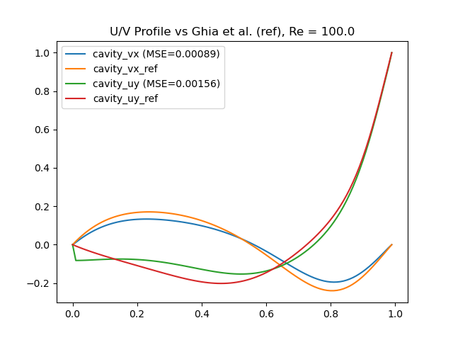

https://readme.so/editor
TODO:


Some pointers how you can improve your code:

- readable and consistent (think PEP8)
- well commented (e.g. functions, important variables, complex code blocks are described)
- contains a 'readme' for basic usage, what the code does briefly, and directions to reproduce test figure
- if there are non-trivial dependencies there is a 'readme.txt/.md' that states the required libraries and their versions
- it is nice to have some test included, be it simple assertions (as mentioned on the main page of the course) or better yet unit tests
The code contributes 30% of the final mark.
---------------------------------------------------------------------------------------------------------------------------------------

# project-computational-science

A simple lattice-Boltzmann implementation for 2D flow simulations with particle tracking


# Contents
This LBM code includes:
- D2Q9 lattice
- BGK collision
- Bounce back


# Run simulation

Note: Some simulations can take a while to run. Also be warned that when using many iterations it may use a decent amount of disk space. About 0.1MB per iteration.

Using `Experiment.py` in the repository we can simulate the following experiments:
- Lid driven cavity
- Karman vortex
- Own experiment, with our own map created in `maps/concept.txt` using `mapeditor.py`. Setting up behaviour for the inlets and outlets in the function "own_experiment" in `Experiment.py` will result in different simulations.
- ...

Specify in `Experiment.py` the initial conditions. 


# Benchmarks
## Lid-driven cavity
A simple lid driven cavity test in a 100x100 unit square. Below are the computed velocity norms at Reynolds number = 100, after 1500 iterations.

A comparison of `uy = f(y)` and `vx = f(x)` at the center of the domain with reference data from <a href="https://www.sciencedirect.com/science/article/pii/0021999182900584">"U. Ghia, K. N. Ghia, C. T. Shin, *High-Re solutions for incompressible flow using Navier-Stokes equations and multigrid method*"</a> (placed in `validation/cavity_vx_ref.txt`). MSE errors for vx and uy are given such that comparison between different LBM can be made.

<p align="center">
  

  
</p>


# Applications

## Map editor
Using the map editor we can create our own environment with the following map attributes:
- AIR
-- Acts as a medium for the fluid.
- WALL
-- Causes fluid to bounce back.
- INLET
-- Creates a rightward flow of fluid. Velocity is set according to u_lb.
- OUTLET
-- Causes fluid to 'exit' the domain.
- INFECTED
-- Infected person where particles spawn.
- SUSCEPTIBLE
-- Susceptible person can get infected with particles. (don't become INFECTED in simulation)


## Authors

- Jeroen van den Berg
- Erencan Tatar
- Robbie Koevoets


## Dependencies
To install the required dependencies, simply run `pip install -r requirements.txt`
```
matplotlib==3.3.2
numpy==1.19.2
opencv_contrib_python==4.5.1.48
pandas==1.1.3
scipy==1.5.2
```
