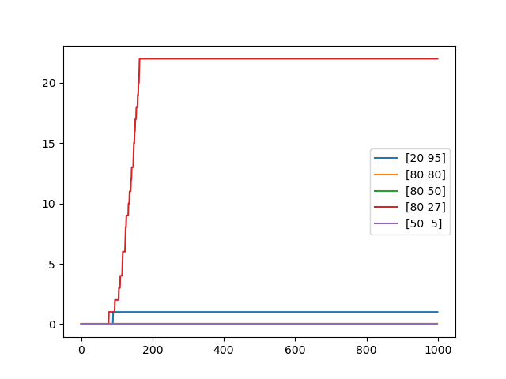

https://readme.so/editor


# project-computational-science

A simple lattice-Boltzmann implementation for 2D flow simulations


# Contents
This LBM code includes:
- D2Q9 lattice
- BGK collision
- bounce back 
- ....


# Run simulation

Using `Experiment.py` in the repository we can simulate the following 
-- Lid driven cavity
-- Karman vortex
-- Own experiment, with our own map created in `maps/concept.txt` using `mapeditor.py`


# Benchmarks
## Lid-driven cavity
..... 
## Karman vortex
.....


# Applications

- Map editor 


## API Reference

#### Get all items

```http
  GET /api/items
```

| Parameter | Type     | Description                |
| :-------- | :------- | :------------------------- |
| `api_key` | `string` | **Required**. Your API key |

#### Get item

```http
  GET /api/items/${id}
```

| Parameter | Type     | Description                       |
| :-------- | :------- | :-------------------------------- |
| `id`      | `string` | **Required**. Id of item to fetch |

#### add(num1, num2)

Takes two numbers and returns the sum.


## Acknowledgements

 - [Awesome Readme Templates](https://awesomeopensource.com/project/elangosundar/awesome-README-templates)
 - [Awesome README](https://github.com/matiassingers/awesome-readme)
 - [How to write a Good readme](https://bulldogjob.com/news/449-how-to-write-a-good-readme-for-your-github-project)


## Authors

- [@katherinepeterson](https://www.github.com/octokatherine)


## Feedback

If you have any feedback, please reach out to us at fake@fake.com


## Installation

Install my-project with npm

```bash
  npm install my-project
  cd my-project
```
    





