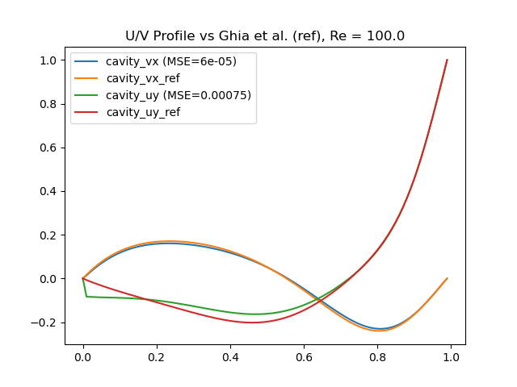

https://readme.so/editor
TODO:


Some pointers how you can improve your code:

- readable and consistent (think PEP8)
- well commented (e.g. functions, important variables, complex code blocks are described)
- contains a 'readme' for basic usage, what the code does briefly, and directions to reproduce test figure
- if there are non-trivial dependencies there is a 'readme.txt/.md' that states the required libraries and their versions
- it is nice to have some test included, be it simple assertions (as mentioned on the main page of the course) or better yet unit tests
The code contributes 30% of the final mark.
---------------------------------------------------------------------------------------------------------------------------------------

# project-computational-science

A simple lattice-Boltzmann implementation for 2D flow simulations


# Contents
This LBM code includes:
- D2Q9 lattice
- BGK collision
- bounce back
- ....


# Run simulation

Using `Experiment.py` in the repository we can simulate the following
- Lid driven cavity
- Karman vortex
- Own experiment, with our own map created in `maps/concept.txt` using `mapeditor.py`. Setting up behaviour for the inlets and outlets in the function "own_experimetn" in `Experiment.py` will result in different simulations.
- ...


# Benchmarks
## Lid-driven cavity
.....
Re=100




## Karman vortex
.....


# Applications

## Map editor
Using the map editor we can create our own environment with the following map attributes:
- AIR
- WALL
- INLET
- OUTLET
- INFECTED
- SUSCEPTIBLE


## Authors

- [Jeroen van den Berg]()
- [Erencan Tatar]()
- [Robbie Koevoets](mailto:robbie.koevoets@student.uva.nl)


## Installation

Install my-project with npm

```bash
  npm install my-project
  cd my-project
```


